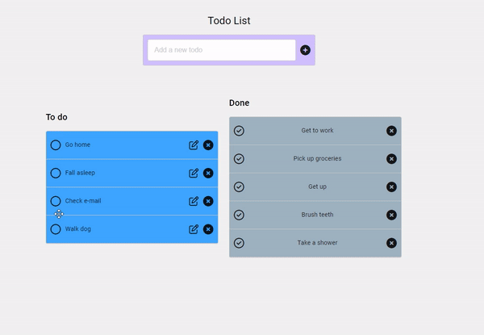

# TodoList Projesi

Bu proje, Angular ve ASP.NET Core Web API kullanılarak geliştirilen bir "Todo List" uygulamasını içermektedir. Kullanıcılar, yapılacak işleri bu uygulama üzerinden ekleyebilir, yapıldığına dair işaretleyebilir ve silebilirler.

## Kullanılan Teknolojiler

- Angular (Frontend)
- ASP.NET Core Web API (Backend)
- Entity Framework Core (Code First)

## Angular - Frontend

Angular kütüphanesi kullanılarak oluşturulan frontend kısmında, kullanıcılar işlerini ekleyebilir, işaretleme yapabilir ve silebilirler. Aynı zamanda Angular CDK Drag and Drop özelliği ile işleri sürükleyip bırakarak sıralayabilirler.

### Önemli Dosyalar

- **app.component.html**: TodoList uygulamasının HTML şablonunu içerir.
- **app.component.ts**: TodoList uygulamasının TypeScript kodlarını içerir.

## ASP.NET Core Web API - Backend

ASP.NET Core Web API kullanılarak oluşturulan backend kısmında, istemcilerle haberleşme sağlayarak işlemleri gerçekleştirir. Entity Framework Core kullanılarak veritabanı işlemleri gerçekleştirilir.

### Önemli Dosyalar

- **TodosController.cs**: Todo işlemleri için API endpoint'leri ve iş mantığı bu dosyada bulunur.
- **AppDbContext.cs**: Entity Framework ile ilişkilendirilmiş veritabanı context sınıfıdır.

## Proje Görseli

